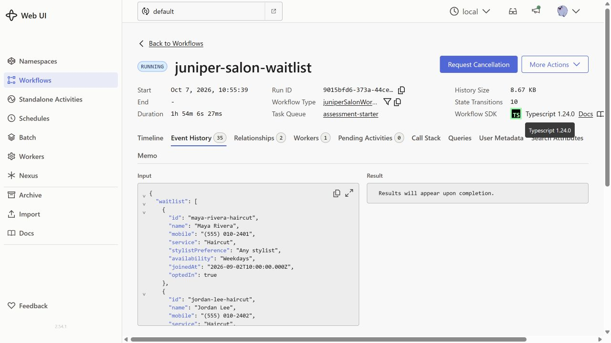
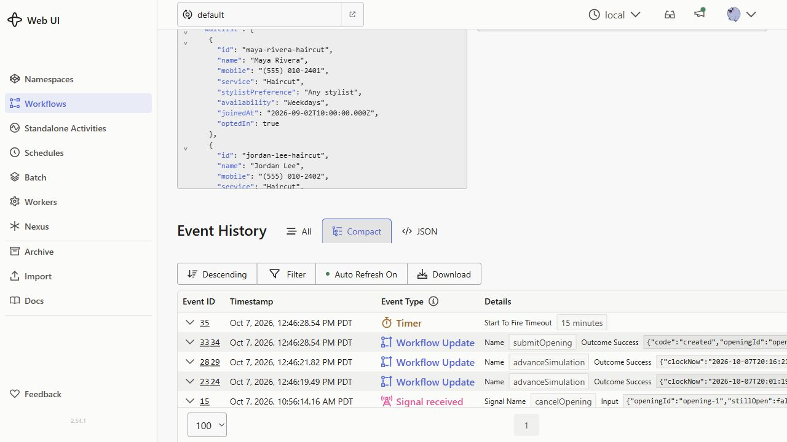

# Evidence

Captured from the local Temporal Web UI on October 7, 2026. These are screenshots of the running salon workflow, with fictional seed clients and fake contact information.

- Workflow ID: `juniper-salon-waitlist`
- Run ID: `9015bfd6-373a-44ce-8f68-52556b33f814`
- Namespace: `default`
- Task queue: `assessment-starter`

## Workflow overview

The overview shows the running workflow, its identity, event count and connected worker. The salon workflow remains running so it can handle additional openings and replies; this status does not mean every appointment is still available.

## Meaningful event history

The compact history shows the 15-minute offer timer, opening creation through the `submitOpening` update, simulated time advancement through `advanceSimulation`, and a staff cancellation signal. This demonstrates Temporal recording the operations and waiting on a durable timer. The automated behavior checks are documented separately in the verification checklist.

